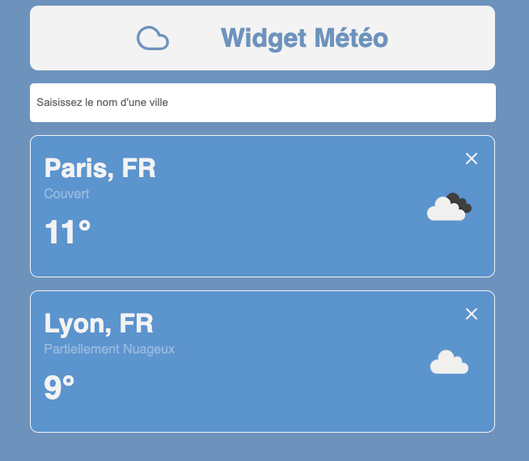

# Météo Widget Redux

## Structure statique

On veut une app qui affiche des villes (avec leur météo) et un formulaire qui permet d'ajouter une ville à la liste.

Au niveau du style vous faites comme vous voulez, une idée de rendu : 



La structure des composants pourrait être la suivante : 
```
-> App
  -> Form
  -> CityList
    -> City (Lyon)
    -> City (Paris)
    -> ...
```
-> Le composant **Form** affiche un formulaire contenant un input   
-> Le composant **CityList** contient une liste de villes `["Paris", "Lyon", "Montpellier"]` et pour chaque ville il affiche un sous-composant City  
-> Le sous composant **City** affiche une ville dont le nom sera reçu en props ! *Et pour l'instant une temperature en dur, on peut dire qu'il fait 10°C et du soleil partout (on verra plus tard pour recuperer les vraies infos d'une api)*  

## Gestion des interaction utilisateurs : ajout d'une ville 
### Mise en place du state Redux

Au submit du form, on veut pouvoir ajouter une ville dans la liste et que l'interface se mette à jour pour l'afficher. On doit donc placer la liste des villes dans un state.
Mettons en place un state dans un store redux 💪

-> Suivre la [fiche recap](https://github.com/O-clock-Muffin/Spe-React-recaps/blob/main/recap-E13-redux-toolkit-react.md) ici pour les étapes   
-> inspirez vous du [repo ChatRoom](https://github.com/O-clock-Muffin/Spe-React-E13-Chatroom-SoleneOclock)   
-> n'utilisez pas chatGPT pour générez du code ;)   

Let's go !!

## Bonus : suppression d'une ville 

Vous pouvez ajouter une petite croix sur chaque bloc ville et au click dessus supprimer cette ville de la liste !

## Mega bonus : call API 🥵

Au rendu du composant City, aller interroger l'API pour chercher la température actuelle de la ville. On peut stocker la temperature reçue dans un state local au composant ☀️
-> adresse de l'API : https://openweathermap.org/api